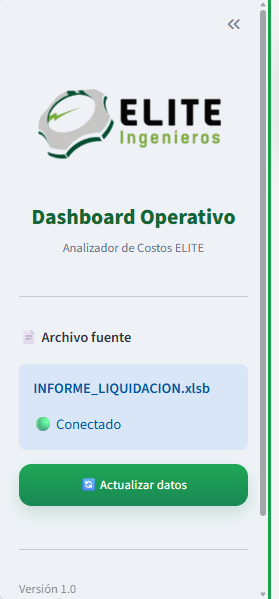

# 🧭 Capítulo 04 - Construcción de un Sidebar Profesional

## Introducción

El Sidebar representa uno de los componentes más importantes de un Dashboard.

Es el primer elemento con el que normalmente interactúa el usuario y su función consiste en ofrecer información de contexto, herramientas de configuración y acceso rápido a determinadas funciones del sistema.

En este Framework el Sidebar será construido siguiendo una filosofía completamente diferente a la utilizada en muchos ejemplos encontrados en Internet.

La experiencia obtenida durante el desarrollo de diferentes proyectos permitió identificar varias limitaciones del Sidebar de Streamlit, especialmente relacionadas con la navegación.

Por esta razón se adoptó una arquitectura propia que será utilizada en todos los Dashboards desarrollados con este Framework.

---

# Objetivo

Construir un Sidebar profesional, reutilizable y fácil de mantener.

Al finalizar este capítulo tendrás un componente completamente funcional que podrá reutilizarse en cualquier Dashboard desarrollado con Streamlit.

---

# Filosofía del Sidebar

Existe una regla muy importante dentro de este Framework.

> **El Sidebar informa.**

> **El Dashboard trabaja.**

Esto significa que el Sidebar nunca será utilizado para construir la navegación principal de la aplicación.

Su responsabilidad consiste únicamente en mostrar información relevante para el usuario y ofrecer herramientas de configuración.

---

# ¿Por qué no utilizamos el Sidebar como menú principal?

Durante el desarrollo del Dashboard Servitravel se identificó un comportamiento importante de Streamlit.

Cuando el usuario presiona el botón:

<<

el Sidebar desaparece completamente.

Si la navegación principal se encuentra allí, el usuario pierde el acceso al Dashboard.

Por esta razón se decidió mover la navegación al área principal utilizando componentes horizontales.

Esta decisión mejoró considerablemente la experiencia de usuario.

---

# 🧠 Decisión de Arquitectura

Durante el desarrollo del Dashboard Servitravel se evaluaron diferentes alternativas para construir la navegación principal.

La primera opción consistía en utilizar el Sidebar como menú principal de la aplicación, ya que Streamlit lo incorpora de forma nativa.

Sin embargo, durante las pruebas realizadas se identificó una limitación importante.

Cuando el usuario presiona el botón **<<** ubicado en la esquina superior izquierda, Streamlit contrae completamente el Sidebar.

Como consecuencia:

- Desaparece el menú principal.
- Desaparecen los botones de navegación.
- Desaparecen los botones de actualización.
- El usuario puede perder rápidamente la referencia de cómo volver a abrir el Sidebar.

Aunque Streamlit permite volver a mostrarlo, muchos usuarios finales no identifican fácilmente este comportamiento.

En aplicaciones empresariales esto genera llamadas de soporte innecesarias y una mala experiencia de usuario.

Por esta razón se tomó la decisión de adoptar una arquitectura diferente.

## Arquitectura adoptada

Dentro del Framework la navegación principal siempre permanecerá visible en el cuerpo del Dashboard.

El Sidebar quedará reservado únicamente para información de contexto y acciones secundarias.

Esta decisión garantiza que el usuario nunca pierda acceso a las funciones principales de la aplicación.

---

# Comparación de enfoques

| Sidebar como menú | Navegación horizontal |
|-------------------|-----------------------|
| ❌ Puede ocultarse completamente | ✅ Siempre visible |
| ❌ Mayor dependencia del Sidebar | ✅ Independiente del Sidebar |
| ❌ Usuarios pueden perder el menú | ✅ Menú siempre disponible |
| ❌ Mayor cantidad de soporte | ✅ Mejor experiencia de usuario |
| ❌ Difícil para usuarios nuevos | ✅ Mucho más intuitivo |

---

# ⚠️ Problemas encontrados durante el desarrollo

Durante la construcción del Dashboard Servitravel se identificaron los siguientes inconvenientes.

## Problema 1

El usuario contraía accidentalmente el Sidebar.

### Consecuencia

Perdía acceso al menú principal.

### Solución

Mover la navegación al cuerpo del Dashboard.

---

## Problema 2

El Sidebar comenzaba a llenarse de componentes.

### Consecuencia

La interfaz se veía saturada.

### Solución

Mantener únicamente información de contexto.

---

# 🚫 Componentes prohibidos en el Sidebar

Como estándar del Framework no se recomienda colocar en el Sidebar:

❌ KPIs.

❌ Tablas.

❌ AgGrid.

❌ Gráficos.

❌ Reportes.

❌ Información extensa.

❌ Navegación principal.

❌ Botones críticos para la operación.

---

> 💡 Filosofía del Framework
>
> El Sidebar proporciona contexto.
>
> El Banner proporciona identidad.
>
> La navegación dirige la aplicación.
>
> El contenido genera valor.

---


# Responsabilidades del Sidebar

Dentro de este Framework el Sidebar únicamente tendrá las siguientes responsabilidades.

✔ Mostrar el logotipo corporativo.

✔ Mostrar el nombre del Dashboard.

✔ Mostrar información general.

✔ Mostrar el archivo fuente.

✔ Mostrar el estado del sistema.

✔ Permitir actualizar la información.

✔ Mostrar la versión de la aplicación.

Nada más.

---

# ¿Qué NO debe contener?

Nunca colocar dentro del Sidebar:

❌ Navegación principal.

❌ KPIs.

❌ Gráficos.

❌ Tablas.

❌ Reportes.

❌ Información extensa.

Todo esto pertenece al cuerpo principal del Dashboard.

---

# Flujo del Sidebar

```text
Logo

↓

Nombre del Dashboard

↓

Descripción

↓

Archivo Fuente

↓

Estado

↓

Actualizar

↓

Versión
```

Este será el orden utilizado en todos los proyectos.

---

# Diseño visual

El Sidebar debe transmitir identidad corporativa.

Se recomienda utilizar siempre:

• Logo institucional.

• Colores corporativos.

• Espaciados uniformes.

• Separadores.

• Iconografía consistente.

• Tipografía homogénea.

---

# Resultado esperado

Al finalizar este capítulo el Sidebar deberá mostrar una apariencia similar a la siguiente.

El Sidebar debe mantener una apariencia limpia, corporativa y organizada, mostrando únicamente la información necesaria para el usuario.



**Figura 4.1.** Sidebar profesional desarrollado para el Dashboard Servitravel y adoptado como plantilla oficial del Framework Dashboards Streamlit.

# Análisis de la Figura 4.1

La Figura 4.1 muestra el diseño definitivo del Sidebar adoptado como estándar por el Framework.

Durante el desarrollo se buscó construir un componente que ofreciera información útil al usuario sin sobrecargar la interfaz principal.

El Sidebar se divide en siete zonas claramente diferenciadas.
---

# ⭐ Plantilla Oficial del Framework

Una vez comprendida la filosofía del componente, es momento de incorporar el archivo oficial utilizado por el Framework.

──────────────────────────────────────────────

📌 ACCIÓN

Copie y pegue aquí el archivo oficial:

sidebar.py

Mantenga la estructura general.

Únicamente modifique el contenido específico del Dashboard.

```python
from pathlib import Path

import streamlit as st


# ==========================================================
# RUTA LOGO
# ==========================================================

BASE = Path(__file__).resolve().parent.parent

LOGO = BASE / "assets" / "logo_elite.png"


# ==========================================================
# SIDEBAR
# ==========================================================

def mostrar_sidebar(hojas):

    with st.sidebar:

        # ==================================================
        # LOGO
        # ==================================================

        if LOGO.exists():

            st.image(
                str(LOGO),
                use_container_width=True
            )

        st.markdown(
            """
            <div class="sidebar-title">
                Dashboard Operativo
            </div>

            <div class="sidebar-subtitle">
                Analizador de Costos ELITE
            </div>
            """,
            unsafe_allow_html=True,
        )

        st.divider()

        # ==================================================
        # ARCHIVO FUENTE
        # ==================================================

        st.markdown("**📄 Archivo fuente**")

        st.info(
            """
**INFORME_LIQUIDACION.xlsb**

🟢 Conectado
"""
        )

        # ==================================================
        # ACTUALIZAR
        # ==================================================

        if st.button(

            "🔄 Actualizar datos",

            use_container_width=True,

            type="primary",

        ):

            st.cache_data.clear()

            st.rerun()

        st.divider()

        st.caption("Versión 1.0")

    # ======================================================
    # COMPATIBILIDAD
    # ======================================================

    hoja = "RODAMIENTOS"

    df = hojas.get(hoja)

    return {

        "hoja": hoja,

        "df": df,

    }
```

──────────────────────────────────────────────

---

# ¿Qué debo modificar?

Normalmente solo será necesario modificar:

| Elemento | ¿Debe modificarse? |
|-----------|--------------------|
| Logo | ✅ Sí |
| Nombre del Dashboard | ✅ Sí |
| Descripción | ✅ Sí |
| Archivo Fuente | ✅ Sí |
| Estado | ✅ Sí |
| Versión | ✅ Sí |

---

# ¿Qué NO debo modificar?

No se recomienda modificar la estructura general.

```text
Logo

↓

Título

↓

Información

↓

Archivo

↓

Actualizar

↓

Versión
```

Tampoco se recomienda mover la navegación principal al Sidebar.

---

# Buenas prácticas

✔ Mantener el Sidebar limpio.

✔ Mostrar únicamente información importante.

✔ Utilizar un solo botón principal.

✔ Utilizar separadores.

✔ Mostrar siempre la versión del sistema.

✔ Mantener una apariencia corporativa.

---

# Errores comunes

❌ Colocar demasiada información.

❌ Convertir el Sidebar en un menú gigante.

❌ Mostrar tablas.

❌ Mostrar gráficos.

❌ Construir la navegación principal allí.

❌ Utilizar demasiados colores.

---

# Lecciones aprendidas

Durante el desarrollo de diferentes Dashboards se identificó que un Sidebar pequeño mejora considerablemente la experiencia del usuario.

También se comprobó que mantener la navegación principal en el área central evita problemas cuando el usuario contrae el Sidebar mediante el botón << de Streamlit.

Esta decisión se convirtió en una de las reglas principales del Framework.

---

# Checklist

Antes de continuar verifica que:

☐ El logo carga correctamente.

☐ El título aparece.

☐ El archivo fuente se muestra.

☐ El estado del sistema funciona.

☐ El botón Actualizar responde correctamente.

☐ La versión es visible.

☐ El Sidebar mantiene un diseño limpio.

☐ La navegación principal NO depende del Sidebar.

---

# Próximo capítulo

En el siguiente capítulo construiremos el Banner Corporativo.

Aprenderemos:

• ¿Por qué utilizar HTML en lugar de columnas?

• Cómo construir un Banner reutilizable.

• Cómo integrar CSS corporativo.

• Cómo mostrar estados del sistema.

• Cómo mantener compatibilidad entre versiones de Streamlit.