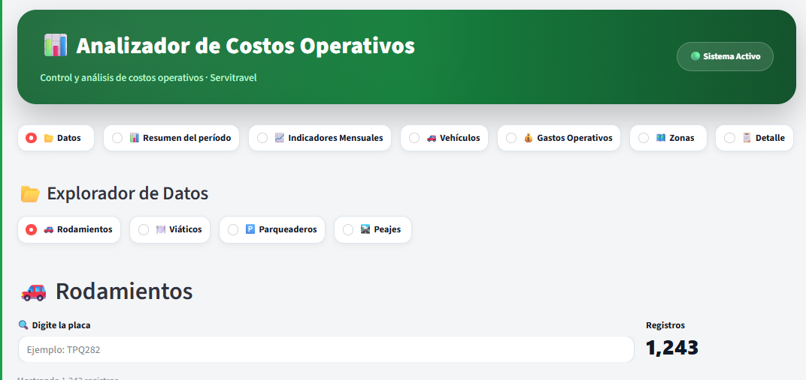

# 🧭 Capítulo 06 - Navegación Principal

## Introducción

La navegación constituye uno de los componentes más importantes de
cualquier Dashboard.

Su objetivo consiste en permitir que el usuario acceda rápidamente a los
diferentes módulos de la aplicación sin perder el contexto de trabajo.

Durante el desarrollo del Dashboard **Servitravel** se comprobó que la
navegación no debía depender del Sidebar de Streamlit. A partir de esa
experiencia se definió una arquitectura reutilizable que pasa a formar
parte del Framework.

------------------------------------------------------------------------

# Objetivo

Construir una navegación profesional, reutilizable y desacoplada de la
lógica del negocio.

La navegación únicamente decide **qué módulo mostrar**. No procesa
datos, no calcula KPIs y no construye tablas.

------------------------------------------------------------------------

# Filosofía del Framework

> **El Banner identifica.**

> **El Sidebar proporciona contexto.**

> **La Navegación dirige la aplicación.**

> **El Contenido genera valor.**

------------------------------------------------------------------------

# ¿Por qué la navegación no está en el Sidebar?

Durante las pruebas realizadas se identificó que el Sidebar puede
contraerse mediante el botón `<<`.

Cuando esto ocurre el usuario pierde el acceso al menú si éste se
encuentra dentro del Sidebar.

Por esta razón el Framework adopta la siguiente regla:

> **La navegación principal siempre permanecerá visible debajo del
> Banner.**

------------------------------------------------------------------------

# Arquitectura de Navegación

``` text
Banner
    ↓
Navegación Principal
    ↓
Navegación Secundaria (Opcional)
    ↓
Contenido
```

------------------------------------------------------------------------

# Resultado esperado

Al finalizar este capítulo la navegación deberá presentar una apariencia
similar a la siguiente.



**Figura 6.1.** Navegación principal utilizada como referencia para el
Framework.

------------------------------------------------------------------------

# Análisis de la Figura 6.1

La navegación se encuentra organizada en cuatro niveles.

## Nivel 1 -- Banner

Identifica el Dashboard y muestra el estado del sistema.

## Nivel 2 -- Navegación Principal

Permite acceder a los módulos funcionales del Dashboard.

Ejemplo:

-   📁 Datos
-   📊 Resumen del período
-   📈 Indicadores
-   🚚 Vehículos
-   💰 Gastos Operativos
-   🗺️ Zonas
-   📋 Detalle

## Nivel 3 -- Navegación Secundaria

Cuando un módulo contiene varios conjuntos de información se recomienda
utilizar un segundo nivel de navegación.

Ejemplo:

-   🚗 Rodamientos
-   🍽️ Viáticos
-   🅿️ Parqueaderos
-   🛣️ Peajes

## Nivel 4 -- Contenido

Área destinada a KPIs, tablas, gráficos, mapas e indicadores.

------------------------------------------------------------------------

# ⭐ Plantilla Oficial del Framework

## 📌 Acción

Crear el archivo:

`navegacion.py`

Copiar la siguiente plantilla.

``` python
import streamlit as st

# ==========================================================
# PERSONALIZACIÓN
# ==========================================================

TITULO_MODULO = "📂 Explorador"

OPCIONES = [
    "📊 Resumen",
    "📈 Indicadores",
    "📋 Detalle",
    "📂 Datos"
]

# ==========================================================
# NAVEGACIÓN
# ==========================================================

def mostrar_navegacion():

    st.subheader(TITULO_MODULO)

    opcion = st.radio(
        "",
        OPCIONES,
        horizontal=True,
        label_visibility="collapsed",
        key="menu_principal"
    )

    return opcion
```

------------------------------------------------------------------------

# Integración con app.py

``` python
opcion = mostrar_navegacion()

if opcion == "📊 Resumen":
    mostrar_resumen()

elif opcion == "📈 Indicadores":
    mostrar_indicadores()

elif opcion == "📋 Detalle":
    mostrar_detalle()

elif opcion == "📂 Datos":
    mostrar_datos()
```

------------------------------------------------------------------------

# ¿Qué debo personalizar?

  Parámetro       Descripción
  --------------- --------------------------------------
  TITULO_MODULO   Título mostrado sobre la navegación.
  OPCIONES        Lista de módulos del Dashboard.

------------------------------------------------------------------------

# ¿Qué NO debo modificar?

No modificar la responsabilidad del componente.

La navegación únicamente selecciona el módulo activo.

No debe contener:

-   Cálculos.
-   KPIs.
-   Tablas.
-   Consultas a bases de datos.
-   Gráficos.

------------------------------------------------------------------------

# Buenas prácticas

-   Mantener pocas opciones por nivel.
-   Utilizar iconografía consistente.
-   Separar la navegación del contenido.
-   Mantener la navegación siempre visible.
-   Reutilizar la plantilla oficial.

------------------------------------------------------------------------

# Errores comunes

-   Colocar la navegación dentro del Sidebar.
-   Mezclar navegación con lógica del negocio.
-   Crear demasiadas opciones en una sola fila.
-   Duplicar la navegación en diferentes módulos.

------------------------------------------------------------------------

# Lecciones aprendidas

Después de diferentes pruebas se comprobó que una navegación
independiente del Sidebar mejora la experiencia del usuario y facilita
el mantenimiento del Dashboard.

La navegación decide **qué mostrar**, mientras que cada módulo decide
**cómo mostrarlo**.

------------------------------------------------------------------------

# Checklist

☐ La navegación permanece visible.

☐ El Sidebar no contiene el menú principal.

☐ Cada opción abre un módulo independiente.

☐ La navegación no contiene lógica de negocio.

☐ La arquitectura coincide con el Framework.

------------------------------------------------------------------------

# Próximo capítulo

En el siguiente capítulo construiremos **styles.py**, donde se
documentará el sistema de estilos responsable de la identidad visual del
Framework.
