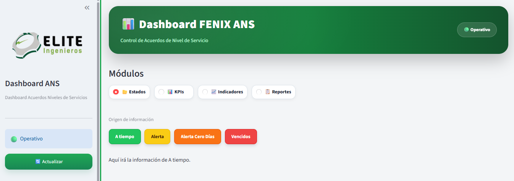

# Capítulo 13 - Gráficos Profesionales

---

# Objetivo

Los gráficos representan visualmente la información calculada mediante los KPIs.

Su propósito es facilitar la identificación de tendencias, comparaciones, distribuciones y comportamientos del negocio, permitiendo que el usuario interprete rápidamente los datos sin necesidad de revisar tablas detalladas.

Dentro del Framework ELITE, todos los gráficos deberán construirse siguiendo criterios de claridad, consistencia visual y rendimiento.

---

# Arquitectura

```

Fuente de Datos

↓

DataFrame

↓

Transformación

↓

KPIs

↓

Gráfico

↓

Dashboard

```

---

# Principios del Framework

Todo gráfico debe responder una pregunta del negocio.

No debe construirse únicamente por razones estéticas.

Antes de agregar un gráfico al Dashboard se debe responder:

- ¿Qué información deseo comunicar?
- ¿Qué decisión ayudará a tomar?
- ¿Existe una forma más simple de mostrarla?

---

# Flujo General

```

Datos

↓

Agrupación

↓

Cálculos

↓

Indicadores

↓

Gráfico

↓

Interpretación

```

---

# Tipos de gráficos soportados

| Tipo | Objetivo |
|-------|----------|
| Barras | Comparar categorías |
| Líneas | Mostrar tendencias |
| Áreas | Evolución acumulada |
| Dona | Participación porcentual |
| Dispersión | Relación entre variables |
| Heatmap | Concentración |
| Treemap | Jerarquías |
| Gauge | Cumplimiento |
| Mapa | Distribución geográfica |

---

# Reglas Visuales

✔ Títulos claros.

✔ Mostrar unidades.

✔ Colores corporativos.

✔ Leyendas visibles.

✔ Escalas correctas.

✔ Evitar saturación de información.

✔ Mantener el mismo estilo en todo el Dashboard.

---

# Estructura de un gráfico

Todo gráfico del Framework deberá estar compuesto por:

Título

↓

Subtítulo (opcional)

↓

Gráfico

↓

Leyenda

↓

Fuente de datos (opcional)

---

# Plantilla Oficial

Todo gráfico deberá documentarse utilizando la siguiente estructura.

| Campo | Descripción |
|--------|-------------|
| Nombre | Nombre del gráfico |
| Objetivo | ¿Qué comunica? |
| Pregunta de negocio | ¿Qué responde? |
| Tipo | Barras, Líneas, Dona... |
| Fuente de datos | DataFrame utilizado |
| Columnas | Campos utilizados |
| Agrupación | groupby() aplicado |
| KPI relacionado | Indicador asociado |
| Librería | Plotly |
| Función | px.bar(), px.line(), etc. |
| Colores | Paleta utilizada |
| Interacción | Hover, Zoom, Leyenda |
| Resultado esperado | Descripción |

---

# Componentes del Capítulo

13.1 Barras

13.2 Líneas

13.3 Áreas

13.4 Dona

13.5 Dispersión

13.6 Heatmap

13.7 Gauge

13.8 Treemap

13.9 Mapas

13.10 Buenas Prácticas

# 13.1 - Barras

---

## Objetivo

Comparar valores entre categorías.

---

## ¿Cuándo utilizarlo?

✔ Comparaciones.

✔ Rankings.

✔ Top N.

✔ Bottom N.

---

## Casos Empresariales

- Ventas por ciudad.

- Horas extras por vehículo.

- Pedidos por técnico.

- Costos por regional.

---

## Función Plotly

```python
px.bar()
```

---

## Buenas prácticas

✔ Ordenar de mayor a menor.

✔ Etiquetas visibles.

✔ Pocos colores.

✔ Evitar demasiadas categorías.

# 13.2 - Líneas

---

## Objetivo

Mostrar tendencias en el tiempo.

---

## Casos

- Ventas mensuales.

- Producción diaria.

- Cumplimiento ANS.

---

## Función

```python
px.line()
```

---

## Buenas prácticas

✔ Orden cronológico.

✔ Marcadores.

✔ Máximo pocas series simultáneas.

# 13.3 - Áreas

---

## Objetivo

Mostrar crecimiento acumulado.

---

## Casos

- Producción.

- Ventas.

- Inventarios.

---

## Función

```python
px.area()
```

---

## Recomendaciones

Utilizar únicamente cuando interese visualizar acumulados.

# 13.4 - Dona

---

## Objetivo

Representar participación porcentual.

---

## Casos

- Regionales.

- Actividades.

- Tipos de servicio.

---

## Función

```python
px.pie(hole=.5)
```

---

## Buenas prácticas

Máximo seis categorías.

# 13.5 - Scatter

---

## Objetivo

Analizar relaciones entre variables.

---

## Casos

- Tiempo vs Costo.

- Distancia vs Consumo.

- Horas vs Producción.

---

## Función

```python
px.scatter()
```

# 13.6 - Heatmap

---

## Objetivo

Detectar patrones.

---

## Casos

- ANS.

- Producción.

- Cumplimiento.

---

## Función

```python
px.imshow()
```

# 13.7 - Gauge

---

## Objetivo

Mostrar cumplimiento de metas.

---

## Casos

- Nivel de servicio.

- Cumplimiento ANS.

- Productividad.

# 13.8 - Treemap

---

## Objetivo

Visualizar jerarquías.

---

## Casos

- Ventas.

- Inventario.

- Costos.

# 13.9 - Mapas

---

## Objetivo

Mostrar información geográfica.

---

## Casos

- Vehículos.

- Pedidos.

- Cobertura.

- Técnicos.

# 13.10 - Buenas Prácticas

---

## Checklist

□ Título claro.

□ Escala correcta.

□ Colores corporativos.

□ Leyenda.

□ Etiquetas.

□ Responsive.

□ Compatible con filtros.

□ Compatible con KPIs.

□ Compatible con el tema del Dashboard.

---

# Filosofía del Framework

Un gráfico debe simplificar la interpretación de los datos.

Si un usuario necesita explicar el gráfico para entenderlo, probablemente el diseño pueda simplificarse.

La prioridad siempre será comunicar información útil antes que incorporar efectos visuales.

### Biblioteca Oficial de Tablas con AgGrid

# Patrón 01

# Tabla Básica

---

# Objetivo

La Tabla Básica representa el punto de partida para cualquier Dashboard desarrollado con el Framework ELITE.

Su propósito es mostrar un DataFrame de forma organizada, permitiendo al usuario consultar información mediante ordenamiento, filtros y paginación.

Este patrón será la base sobre la cual construiremos todas las tablas más avanzadas del Framework.

---

# ¿Cuándo utilizar este patrón?

Utilice una Tabla Básica cuando:

- El Dashboard apenas está comenzando.
- Se necesita visualizar información rápidamente.
- Aún no se requieren colores corporativos.
- No existen reglas visuales especiales.
- Se desea validar la información del DataFrame.

---

# ¿Cuándo NO utilizarlo?

No es recomendable cuando:

- El Dashboard será utilizado por usuarios finales.
- Se requiere una imagen corporativa.
- Existen estados con colores.
- Se necesita una experiencia visual más profesional.

En estos casos deberá utilizar la **Tabla Corporativa ELITE**, la cual veremos en el siguiente patrón.

---

# Arquitectura

```text
Excel

↓

Pandas

↓

DataFrame

↓

components/tablas.py

↓

AgGrid

↓

Usuario
```

---

# Flujo del Framework

```text
DataFrame

↓

GridOptionsBuilder

↓

Configurar columnas

↓

Configurar Grid

↓

AgGrid

↓

Dashboard
```

---

# Ubicación dentro del proyecto

```text
Proyecto

│

├── app.py

│

├── analytics/

│

├── components/

│      tablas.py
```

Toda la implementación de las tablas debe centralizarse en:

```text
components/tablas.py
```

---

# Plantilla Oficial

```python
from st_aggrid import (
    AgGrid,
    GridOptionsBuilder,
    ColumnsAutoSizeMode,
)

import pandas as pd


def mostrar_tabla(
    df: pd.DataFrame,
    height: int = 420,
):

    if df is None or df.empty:
        return

    gb = GridOptionsBuilder.from_dataframe(df)

    gb.configure_default_column(

        sortable=True,

        filter=True,

        editable=False,

        resizable=True,

    )

    gb.configure_grid_options(

        pagination=True,

        paginationPageSize=20,

    )

    AgGrid(

        df,

        gridOptions=gb.build(),

        theme="streamlit",

        height=height,

        columns_auto_size_mode=ColumnsAutoSizeMode.FIT_CONTENTS,

    )
```

Esta es la tabla mínima recomendada por el Framework.

---

# Integración con app.py

```python
df = cargar_datos()

df_filtrado = mostrar_filtros(df)

mostrar_tabla(df_filtrado)
```

Observe que la tabla siempre recibe:

```python
df_filtrado
```

Nunca debe trabajar con el DataFrame original.

---

# Resultado esperado

El usuario podrá:

✔ Ordenar columnas.

✔ Aplicar filtros.

✔ Cambiar el tamaño de las columnas.

✔ Navegar entre páginas.

✔ Consultar la información de forma rápida.

---

# Buenas prácticas

✔ Mostrar únicamente columnas útiles.

✔ Mantener nombres claros.

✔ Activar filtros.

✔ Activar ordenamiento.

✔ Utilizar paginación.

✔ Mantener un único estilo en todo el Dashboard.

---

# Errores comunes

## Error 1

Mostrar el DataFrame original.

Siempre debe mostrarse:

```python
df_filtrado
```

---

## Error 2

Crear varias funciones para diferentes tablas.

El Framework recomienda reutilizar:

```python
mostrar_tabla()
```

adaptando únicamente el DataFrame recibido.

---

## Error 3

Mostrar columnas técnicas.

Ejemplo:

- ID interno
- Índices
- Campos auxiliares

Estas columnas deben ocultarse al usuario.

---

# Tiempo de implementación

**10 minutos**

---

# Dificultad

⭐☆☆☆☆

---

# Checklist

Antes de continuar verifique que:

☐ Existe `components/tablas.py`.

☐ La tabla recibe `df_filtrado`.

☐ El ordenamiento funciona.

☐ Los filtros funcionan.

☐ La paginación funciona.

☐ El Dashboard mantiene la misma arquitectura.

---

# Regla de Oro

> La Tabla Básica es el punto de partida del Framework. Antes de agregar estilos, colores o personalizaciones, toda tabla debe funcionar correctamente utilizando un único `df_filtrado`.

---

# Próximo patrón

En el siguiente patrón construiremos la **Tabla Corporativa ELITE**, la plantilla oficial del Framework con el mismo estilo profesional utilizado en el Dashboard Servitravel.

# Patrón 02

# Tabla Corporativa ELITE

---

# Objetivo

La Tabla Corporativa ELITE representa el estándar oficial del Framework para la visualización de información tabular.

Su objetivo no es únicamente mostrar un DataFrame, sino ofrecer una experiencia de consulta rápida, organizada y profesional, manteniendo una apariencia consistente en todos los Dashboards desarrollados bajo esta arquitectura.

Esta será la plantilla recomendada para todos los proyectos del Framework.

---

# ¿Cuándo utilizar este patrón?

Utilice la Tabla Corporativa ELITE cuando:

- El Dashboard será utilizado por usuarios finales.
- Se requiere una apariencia profesional.
- Existan miles de registros.
- La tabla represente el componente principal del Dashboard.
- Se desee mantener una imagen corporativa uniforme.

---

# ¿Cuándo NO utilizarlo?

No es necesario cuando:

- Está realizando pruebas rápidas.
- El Dashboard aún se encuentra en desarrollo.
- Solo necesita validar información temporalmente.

En estos casos puede utilizar la **Tabla Básica**.

---

# Arquitectura

```text
Excel / Base de Datos

↓

DataFrame

↓

components/filtros.py

↓

df_filtrado

↓

analytics/

↓

components/tablas.py

↓

Tabla Corporativa ELITE

↓

Usuario
```

Observe que la tabla nunca recibe el DataFrame original.

Siempre trabaja con:

```python
df_filtrado
```

---

# Filosofía del Framework

La tabla no realiza cálculos.

La tabla no aplica reglas de negocio.

La tabla únicamente presenta información.

Todo el procesamiento debe realizarse previamente en:

```text
analytics/
```

---

# Características Oficiales

Toda Tabla Corporativa ELITE deberá incluir como mínimo:

✔ Encabezado corporativo.

✔ Hover sobre filas.

✔ Ordenamiento.

✔ Filtros por columna.

✔ Scroll horizontal.

✔ Scroll vertical.

✔ Paginación.

✔ Columnas redimensionables.

✔ Selección de texto.

✔ Responsive.

✔ Alto rendimiento.

---

# Apariencia recomendada

```text
┌─────────────────────────────────────────────────────┐

 Encabezado Corporativo

──────────────────────────────────────────────────────

 Filtros

──────────────────────────────────────────────────────

 Registros

──────────────────────────────────────────────────────

 Paginación

└─────────────────────────────────────────────────────┘
```

La apariencia debe ser limpia, uniforme y fácil de leer.

---

# Flujo del Framework

```text
DataFrame

↓

Configurar columnas

↓

Configurar Grid

↓

Aplicar estilos

↓

Mostrar AgGrid
```

---

# Integración con app.py

```python
df = cargar_datos()

df_filtrado = mostrar_filtros(df)

kpis = calcular_kpis(df_filtrado)

mostrar_kpis(kpis)

mostrar_graficos(df_filtrado)

mostrar_tabla(df_filtrado)
```

La tabla siempre representa el detalle del Dashboard.

---

# Configuración visual recomendada

## Encabezados

✔ Fondo uniforme.

✔ Texto en negrilla.

✔ Fácil lectura.

---

## Filas

✔ Altura uniforme.

✔ Hover al pasar el mouse.

✔ Espaciado consistente.

---

## Columnas

✔ Redimensionables.

✔ Ordenables.

✔ Filtrables.

✔ Ajuste automático.

---

## Navegación

✔ Scroll horizontal.

✔ Scroll vertical.

✔ Paginación.

---

# Implementación en Servitravel

Actualmente la tabla utilizada en Servitravel es un excelente ejemplo de este patrón.

La información cambia automáticamente cuando el usuario aplica filtros como:

```text
Mes

↓

Placa

↓

Zona

↓

Estado
```

La tabla nunca cambia de estructura.

Únicamente cambia el contenido de:

```python
df_filtrado
```

---

# Implementación en Dashboard ANS

En el Dashboard ANS ocurre exactamente el mismo comportamiento.

```text
Estados

↓

A Tiempo

↓

Tabla
```

```text
Estados

↓

Alerta

↓

Tabla
```

```text
Estados

↓

Alerta 0 Días

↓

Tabla
```

```text
Estados

↓

Vencidos

↓

Tabla
```

Observe que no existen cuatro tablas diferentes.

Existe una única tabla que recibe diferentes DataFrames filtrados.

Esta es la arquitectura recomendada por el Framework.

---

# Buenas prácticas

✔ Mantener una única función:

```python
mostrar_tabla()
```

✔ Reutilizar el mismo componente.

✔ Mostrar únicamente información relevante.

✔ Mantener el mismo estilo en todo el Dashboard.

✔ Configurar una paginación uniforme.

✔ Evitar columnas innecesarias.

---

# Errores comunes

## Error 1

Crear una tabla diferente para cada módulo.

Lo correcto es reutilizar el mismo componente.

---

## Error 2

Modificar el DataFrame dentro de la tabla.

Toda transformación debe realizarse previamente.

---

## Error 3

Mostrar columnas técnicas.

Ejemplo:

- ID
- Índices
- Variables auxiliares
- Campos temporales

Estas columnas no deben visualizarse.

---

## Error 4

Cambiar el diseño de cada tabla.

Todo el Framework debe mantener una identidad visual consistente.

---

# Tiempo de implementación

**20 minutos**

---

# Dificultad

⭐⭐☆☆☆

---

# Checklist

Antes de continuar verifique que:

☐ La tabla recibe `df_filtrado`.

☐ Existe una única función `mostrar_tabla()`.

☐ El encabezado mantiene el diseño corporativo.

☐ El usuario puede ordenar columnas.

☐ El usuario puede aplicar filtros.

☐ La paginación funciona correctamente.

☐ La tabla responde a todos los filtros del Dashboard.

☐ Se mantiene la misma apariencia en todos los módulos.

---

# Regla de Oro

> Una Tabla Corporativa ELITE debe reutilizarse en todos los Dashboards del Framework. Lo único que cambia es el DataFrame recibido; la experiencia visual debe permanecer siempre consistente.

---

# Próximo patrón

En el siguiente patrón construiremos **Tablas con Colores Condicionales**, donde aprenderemos a resaltar automáticamente estados como:

🟢 A Tiempo

🟡 Alerta

🟠 Alerta 0 Días

🔴 Vencidos

utilizando AgGrid y `JsCode`, manteniendo la identidad visual del Framework.

# Patrón 03

# Componentes Visuales Basados en Estado

---

# Objetivo

Uno de los principios fundamentales del Framework ELITE consiste en comunicar información mediante reglas visuales consistentes.

Cuando un usuario observa un Dashboard, debe identificar inmediatamente el estado de un proceso sin necesidad de leer todos los registros.

Para lograrlo, el Framework utiliza una paleta corporativa de colores que representa el significado de cada estado operativo.

Esta regla visual es independiente del componente utilizado.

Puede aplicarse sobre:

- Botones
- Segmentadores
- Tablas
- KPIs
- Tarjetas
- Gráficos

El color representa una regla de negocio previamente calculada.

---

# Filosofía del Framework

Los componentes visuales nunca calculan información.

Su única responsabilidad consiste en representar visualmente un estado ya existente.

La arquitectura correcta es:

```text
Excel

↓

Pandas

↓

Analytics

↓

Columna ESTADO

↓

Componente Visual

↓

Usuario
```

Observe que el estado siempre es calculado previamente por Analytics.

El componente únicamente interpreta ese valor.

---

# Regla Visual Corporativa

Todos los Dashboards desarrollados con el Framework deberán utilizar la misma semántica visual.

| Estado | Color Oficial | Significado |
|---------|---------------|-------------|
| 🟢 A Tiempo | Verde | Cumple el ANS |
| 🟡 Alerta | Amarillo | Próximo al vencimiento |
| 🟠 Alerta Cero Días | Naranja | Último día disponible |
| 🔴 Vencidos | Rojo | ANS incumplido |

Esta convención nunca debe modificarse entre proyectos.

La consistencia visual permite que el usuario identifique inmediatamente el estado de un registro, independientemente del Dashboard que esté utilizando.

---

# Arquitectura

```text
Regla de Negocio

↓

Estado

↓

Color Corporativo

↓

Componente Visual

↓

Usuario
```

El color depende del estado.

Nunca ocurre lo contrario.

---

# Componentes donde aplicar el patrón

El mismo estándar visual puede reutilizarse en múltiples componentes.

## Segmented Control

```text
A Tiempo

↓

Botón Verde
```

```text
Alerta

↓

Botón Amarillo
```

```text
Alerta Cero Días

↓

Botón Naranja
```

```text
Vencidos

↓

Botón Rojo
```

Es el mismo comportamiento implementado en el Dashboard FENIX ANS.

---

## AgGrid

La columna Estado puede colorearse utilizando:

```python
JsCode
```

Cada fila mantiene la misma semántica visual del Dashboard.

---

## KPIs

```text
🟢 235
```

```text
🟡 18
```

```text
🟠 6
```

```text
🔴 12
```

Los indicadores mantienen exactamente la misma identidad visual.

---

## Tarjetas (Cards)

```text
🟢 A Tiempo
```

```text
🟡 Alerta
```

```text
🟠 Alerta Cero Días
```

```text
🔴 Vencidos
```

---

## Gráficos

Cuando un gráfico represente estados del ANS deberá utilizar la misma paleta de colores.

Ejemplo:

Verde → A Tiempo

Amarillo → Alerta

Naranja → Alerta Cero Días

Rojo → Vencidos

Nunca deberán utilizarse colores diferentes para representar el mismo estado.

---

# Caso práctico

Dashboard FENIX ANS

El Dashboard implementa este patrón mediante un componente de subnavegación.

```text
Estados

↓

Segmented Control

↓

Color según Estado

↓

Cambio de información
```

Cada botón utiliza:

- Color corporativo.
- Hover.
- Elevación.
- Sombra.
- Estado activo.

El usuario identifica inmediatamente el contexto operativo antes de consultar la información.

Este comportamiento representa la implementación oficial del Framework para componentes basados en estado.

---

# Organización del código

La implementación debe mantenerse separada de la lógica del Dashboard.

Ejemplo:

```text
components/

subnavigation.py
```

Dentro del componente se recomienda mantener dos responsabilidades claramente definidas.

```python
cargar_estilos_subnavigation()
```

Responsable únicamente del diseño visual.

---

```python
mostrar_subnavigation()
```

Responsable únicamente de mostrar el componente.

Esta separación facilita el mantenimiento y permite reutilizar el mismo componente en diferentes proyectos.

---

# Buenas prácticas

✔ Utilizar siempre la misma paleta corporativa.

✔ Mantener el mismo significado para cada color.

✔ Aplicar colores únicamente cuando representen una regla de negocio.

✔ Garantizar un buen contraste entre fondo y texto.

✔ Mantener efectos visuales uniformes.

✔ Separar el CSS de la lógica del componente.

✔ Reutilizar el mismo componente en todos los Dashboards.

---

# Errores comunes

## Error 1

Cambiar el significado de los colores entre diferentes proyectos.

Ejemplo:

Verde = A Tiempo

en un Dashboard.

Verde = Pendiente

en otro Dashboard.

Esto rompe la consistencia del Framework.

---

## Error 2

Calcular estados dentro del componente.

Toda la lógica debe existir previamente.

---

## Error 3

Aplicar colores únicamente por estética.

Cada color debe representar una regla de negocio.

---

## Error 4

Mezclar el CSS con la lógica de presentación.

El Framework recomienda separar claramente:

- Estilos.
- Componente.
- Analytics.

---

# Checklist

Antes de finalizar verifique que:

☐ Existe una columna de estado.

☐ El estado fue calculado previamente.

☐ Todos los componentes utilizan la misma paleta.

☐ Existe buen contraste.

☐ El usuario identifica inmediatamente el estado.

☐ Los estilos están separados de la lógica.

☐ El componente puede reutilizarse en otros proyectos.

---

# Regla de Oro

> Los colores no decoran un Dashboard. Los colores comunican una regla de negocio. Todo componente visual del Framework ELITE debe representar los estados mediante una paleta corporativa consistente, reutilizable y fácil de interpretar.

---

# Próximo patrón

En el siguiente patrón construiremos **Formatos Profesionales**, donde aprenderemos a presentar correctamente:

- Monedas.
- Porcentajes.
- Fechas.
- Cantidades.
- Días restantes.
- Valores numéricos.

Con ello lograremos que todas las tablas y componentes del Framework mantengan una presentación uniforme, profesional y lista para entornos empresariales.

# Caso práctico

El Dashboard FENIX ANS implementa este patrón mediante un componente de subnavegación.

La siguiente imagen muestra el resultado esperado.



Características implementadas:

- 🟢 A Tiempo
- 🟡 Alerta
- 🟠 Alerta Cero Días
- 🔴 Vencidos

Además, el componente incorpora:

- Hover.
- Sombras.
- Elevación.
- Estado activo.
- Bordes redondeados.
- Tipografía uniforme.
Esta implementación constituye la plantilla oficial para componentes de subnavegación del Framework ELITE.

Este será el estándar oficial del Framework.

# Estructura del proyecto

```text
Proyecto

│

├── app.py

│

├── components/

│      subnavigation.py

│

├── analytics/

│

└── assets/
```

# Integración con app.py

```python
from components.subnavigation import mostrar_subnavigation

# ==========================================================
# MOSTRAR SUB-NAVIGATION
# Este es un ejemplo si el menu principal lleva un submenu:
# ==========================================================
if opcion == "📂 Estados":

    subopcion = mostrar_subnavigation(

        titulo="Origen de información",

        opciones=[

            "A tiempo",

            "Alerta",

            "Alerta Cero Días",

            "Vencidos",

        ],

    )

if estado == "A tiempo":

    mostrar_atiempo()

elif estado == "Alerta":

    mostrar_alerta()

elif estado == "Alerta Cero Días":

    mostrar_alerta0()

else:

    mostrar_vencidos()
```

Observe que el Dashboard únicamente consulta el estado seleccionado.

Toda la apariencia visual pertenece al componente.

# Plantilla Oficial

## Archivo

```text
components/

subnavigation.py
```

Esta es la implementación oficial utilizada por el Framework ELITE para construir componentes de subnavegación basados en estados: ESTILOS DE LA SUBNAVEGACIÓN y MOSTRAR SUBNAVEGACIÓN

El componente incorpora:

✔ Colores corporativos.

✔ Hover.

✔ Estado activo.

✔ Sombras.

✔ Elevación.

✔ CSS separado de la lógica.

✔ Reutilizable en cualquier Dashboard.

---

```python
import streamlit as st

# ==========================================================
# ESTILOS DE LA SUBNAVEGACIÓN
# ==========================================================

def cargar_estilos_subnavigation():

    st.markdown(
        """
        <style>

        /* Separación entre botones */
        .st-key-subnavigation [data-baseweb="button-group"] {
            gap: 12px;
        }

        /* Diseño general */
        .st-key-subnavigation button {
            min-height: 44px;
            padding: 9px 22px;
            border-radius: 10px !important;
            border-width: 2px !important;

            font-size: 14px !important;
            font-weight: 700 !important;

            transition:
                transform 0.20s ease,
                box-shadow 0.20s ease,
                background-color 0.20s ease;

            box-shadow: 0 4px 9px rgba(15, 23, 42, 0.15);
        }

        .st-key-subnavigation button p {
            font-size: 14px !important;
            font-weight: 700 !important;
            color: inherit !important;
        }


        /* ==================================================
           A TIEMPO — VERDE
        ================================================== */

        .st-key-subnavigation button:nth-child(1) {
            background-color: #22C55E !important;
            border-color: #16A34A !important;
            color: #FFFFFF !important;
        }

        .st-key-subnavigation button:nth-child(1):hover {
            background-color: #16A34A !important;
            border-color: #15803D !important;
            transform: translateY(-2px);
            box-shadow: 0 7px 15px rgba(22, 163, 74, 0.35);
        }

        .st-key-subnavigation
        button:nth-child(1)[data-testid$="Active"] {
            background-color: #15803D !important;
            border-color: #14532D !important;
            color: #FFFFFF !important;
            transform: translateY(-3px) scale(1.04);
            box-shadow:
                0 0 0 3px rgba(34, 197, 94, 0.25),
                0 8px 18px rgba(21, 128, 61, 0.45);
        }


        /* ==================================================
           ALERTA — AMARILLO
        ================================================== */

        .st-key-subnavigation button:nth-child(2) {
            background-color: #FACC15 !important;
            border-color: #EAB308 !important;
            color: #422006 !important;
        }

        .st-key-subnavigation button:nth-child(2):hover {
            background-color: #EAB308 !important;
            border-color: #CA8A04 !important;
            transform: translateY(-2px);
            box-shadow: 0 7px 15px rgba(234, 179, 8, 0.40);
        }

        .st-key-subnavigation
        button:nth-child(2)[data-testid$="Active"] {
            background-color: #CA8A04 !important;
            border-color: #854D0E !important;
            color: #FFFFFF !important;
            transform: translateY(-3px) scale(1.04);
            box-shadow:
                0 0 0 3px rgba(250, 204, 21, 0.30),
                0 8px 18px rgba(202, 138, 4, 0.45);
        }


        /* ==================================================
           ALERTA CERO DÍAS — NARANJA
        ================================================== */

        .st-key-subnavigation button:nth-child(3) {
            background-color: #F97316 !important;
            border-color: #EA580C !important;
            color: #FFFFFF !important;
        }

        .st-key-subnavigation button:nth-child(3):hover {
            background-color: #EA580C !important;
            border-color: #C2410C !important;
            transform: translateY(-2px);
            box-shadow: 0 7px 15px rgba(234, 88, 12, 0.40);
        }

        .st-key-subnavigation
        button:nth-child(3)[data-testid$="Active"] {
            background-color: #C2410C !important;
            border-color: #9A3412 !important;
            color: #FFFFFF !important;
            transform: translateY(-3px) scale(1.04);
            box-shadow:
                0 0 0 3px rgba(249, 115, 22, 0.25),
                0 8px 18px rgba(194, 65, 12, 0.45);
        }


        /* ==================================================
           VENCIDOS — ROJO
        ================================================== */

        .st-key-subnavigation button:nth-child(4) {
            background-color: #EF4444 !important;
            border-color: #DC2626 !important;
            color: #FFFFFF !important;
        }

        .st-key-subnavigation button:nth-child(4):hover {
            background-color: #DC2626 !important;
            border-color: #B91C1C !important;
            transform: translateY(-2px);
            box-shadow: 0 7px 15px rgba(220, 38, 38, 0.40);
        }

        .st-key-subnavigation
        button:nth-child(4)[data-testid$="Active"] {
            background-color: #B91C1C !important;
            border-color: #7F1D1D !important;
            color: #FFFFFF !important;
            transform: translateY(-3px) scale(1.04);
            box-shadow:
                0 0 0 3px rgba(239, 68, 68, 0.25),
                0 8px 18px rgba(185, 28, 28, 0.45);
        }

        </style>
        """,
        unsafe_allow_html=True,
    )
# ==========================================================
# MOSTRAR SUBNAVEGACIÓN
# ==========================================================

def mostrar_subnavigation(
    opciones,
    titulo=None,
):

    cargar_estilos_subnavigation()

    if titulo:
        st.caption(titulo)

    return st.segmented_control(

        label="Estados del ANS",

        options=opciones,

        selection_mode="single",

        default=opciones[0] if opciones else None,

        key="subnavigation",

        label_visibility="collapsed",

    )
```
# Resultado esperado

Al ejecutar:

```bash
streamlit run app.py
```

el Dashboard mostrará una subnavegación con las siguientes características:

✔ Botones con colores corporativos.

✔ Hover profesional.

✔ Elevación al pasar el cursor.

✔ Estado activo resaltado.

✔ Sombras corporativas.

✔ Bordes redondeados.

✔ Tipografía uniforme.

✔ Componente reutilizable.

El resultado será una interfaz consistente con el estándar visual del Framework ELITE.

# Patrón 04

# Formatos Profesionales de Información

---

# Objetivo

Una de las principales características de un Dashboard profesional es la forma como presenta la información.

Aunque dos Dashboards contengan exactamente los mismos datos, una correcta aplicación de formatos mejora la lectura, facilita el análisis y reduce errores de interpretación.

Dentro del Framework ELITE todos los proyectos deberán utilizar un único estándar para representar fechas, valores monetarios, porcentajes, cantidades y demás tipos de información.

El objetivo de este patrón es construir un componente reutilizable que centralice todos los formatos utilizados por el Framework.

---

# Filosofía del Framework

Los formatos nunca modifican el dato.

Su única responsabilidad consiste en representar visualmente la información de una forma clara y consistente.

La arquitectura correcta es:

```text
Excel

↓

Pandas

↓

Analytics

↓

Dato

↓

Formato

↓

Usuario
```

Primero se calcula.

Después se formatea.

Nunca ocurre al contrario.

---

# Estándar Oficial del Framework

Todos los Dashboards deberán utilizar exactamente los mismos formatos.

| Tipo | Ejemplo |
|------|----------|
| Enteros | 12.540 |
| Decimal | 154,28 |
| Moneda | $ 2.350.000 |
| Porcentaje | 98,45 % |
| Fecha | 23/07/2026 |
| Hora | 14:35 |
| Días | 5 días |

Esto garantiza uniformidad entre todos los proyectos.

---

# Arquitectura

```text
Valor

↓

utils/

formatos.py

↓

Componente

↓

Dashboard
```

Todos los componentes consumen las mismas funciones.

Nunca deberán implementar formatos propios.

---

# Componentes donde aplicar el patrón

El mismo estándar deberá utilizarse en:

- KPIs
- AgGrid
- Tarjetas
- Gráficos
- Tooltips
- Indicadores
- Reportes

---

# Caso práctico

Dashboard Servitravel

```text
2350000
```

↓

```text
$ 2.350.000
```

---

Dashboard ANS

```text
98.4523
```

↓

```text
98,45 %
```

---

Dashboard Inventarios

```text
12
```

↓

```text
12 días
```

Todos los módulos mantienen exactamente la misma presentación.

---

# Organización del proyecto

```text
Proyecto

│

├── app.py

│

├── analytics/

│

├── components/

│

└── utils/

        formatos.py
```

Toda la lógica de formato debe centralizarse en un único archivo.

---

# Plantilla Oficial del Framework

## Archivo

```text
utils/

formatos.py
```

Este componente será reutilizado por todos los Dashboards desarrollados bajo el Framework ELITE.

```python
from datetime import datetime
import pandas as pd


# ==========================================================
# MONEDA
# ==========================================================

def formato_moneda(valor):

    if pd.isna(valor):
        return ""

    return f"$ {valor:,.0f}".replace(",", ".")


# ==========================================================
# ENTEROS
# ==========================================================

def formato_entero(valor):

    if pd.isna(valor):
        return ""

    return f"{int(valor):,}".replace(",", ".")


# ==========================================================
# DECIMALES
# ==========================================================

def formato_decimal(valor, decimales=2):

    if pd.isna(valor):
        return ""

    texto = f"{valor:,.{decimales}f}"

    return texto.replace(",", "X").replace(".", ",").replace("X", ".")


# ==========================================================
# PORCENTAJES
# ==========================================================

def formato_porcentaje(valor):

    if pd.isna(valor):
        return ""

    return f"{valor:.2f} %".replace(".", ",")


# ==========================================================
# FECHAS
# ==========================================================

def formato_fecha(fecha):

    if pd.isna(fecha):
        return ""

    return pd.to_datetime(fecha).strftime("%d/%m/%Y")


# ==========================================================
# DÍAS
# ==========================================================

def formato_dias(valor):

    if pd.isna(valor):
        return ""

    return f"{int(valor)} días"
```

Esta es la implementación oficial del Framework.

No se recomienda crear funciones equivalentes en otros módulos.

---

# Integración con app.py

```python
from utils.formatos import (

    formato_moneda,

    formato_porcentaje,

    formato_fecha,

)
```

Ejemplo:

```python
st.metric(

    "Valor",

    formato_moneda(total),

)
```

---

```python
st.metric(

    "Cumplimiento",

    formato_porcentaje(ans),

)
```

---

```python
df["FECHA"] = df["FECHA"].apply(formato_fecha)
```

---

# Resultado esperado

Al ejecutar:

```bash
streamlit run app.py
```

todos los componentes utilizarán exactamente el mismo estándar visual.

No importa si el dato aparece en:

- KPI
- Tabla
- Tarjeta
- Tooltip
- Gráfico

El formato siempre será consistente.

---

# Buenas prácticas

✔ Centralizar todos los formatos.

✔ Reutilizar siempre las funciones oficiales.

✔ Mantener un único estándar visual.

✔ Aplicar formatos antes de mostrar la información.

✔ Evitar formatos escritos manualmente en cada Dashboard.

---

# Errores comunes

## Error 1

Duplicar funciones de formato.

---

## Error 2

Formatear directamente dentro del Dashboard.

---

## Error 3

Mostrar el mismo dato con formatos diferentes.

---

## Error 4

Modificar el dato original para obtener el formato.

---

# Checklist

☐ Existe `utils/formatos.py`.

☐ Todos los KPIs reutilizan las funciones oficiales.

☐ Las tablas utilizan los mismos formatos.

☐ Las fechas mantienen el mismo estándar.

☐ Los porcentajes utilizan el mismo número de decimales.

☐ Los valores monetarios utilizan separador de miles.

☐ No existen funciones duplicadas.

---

# Regla de Oro

> Un Dashboard profesional no inventa formatos. Reutiliza un único componente de formatos para garantizar consistencia, mantenibilidad y una experiencia uniforme en todos los proyectos del Framework ELITE.

---

# Próximo patrón

En el siguiente patrón construiremos los **KPIs Corporativos**, donde desarrollaremos un componente reutilizable para indicadores ejecutivos con identidad visual propia, completamente alineado con el Framework ELITE.