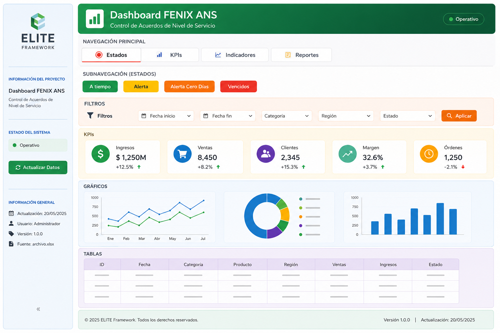

# Dashboard Base

## Framework ELITE

------------------------------------------------------------------------

# Objetivo

El Dashboard Base representa la arquitectura oficial del Framework ELITE
para el desarrollo de aplicaciones de analítica y visualización de
datos.

Este modelo define una estructura estandarizada que permite construir
Dashboards profesionales, reutilizables, escalables y fáciles de
mantener, garantizando que todos los proyectos compartan una misma
identidad visual, organización del código y metodología de desarrollo.

Todo nuevo Dashboard deberá construirse a partir de esta arquitectura,
modificando únicamente aquellos componentes específicos del negocio.

------------------------------------------------------------------------

# Arquitectura General

``` text
Proyecto

│
├── assets/
├── components/
├── config/
├── data/
├── docs/
├── pages/
├── styles/
├── utils/
└── app.py
```

------------------------------------------------------------------------

# Responsabilidad de cada carpeta

  Carpeta      Responsabilidad
  ------------ ---------------------------------------------------
  assets       Logos, imágenes, iconos, CSS y recursos gráficos.
  components   Componentes visuales reutilizables del Dashboard.
  config       Configuración general del proyecto.
  data         Archivos de entrada, salida y datos temporales.
  docs         Documentación técnica y funcional.
  pages        Vistas adicionales del Dashboard.
  styles       Estilos corporativos y temas visuales.
  utils        Funciones auxiliares reutilizables.
  app.py       Punto de entrada principal de la aplicación.

------------------------------------------------------------------------

# Arquitectura por Capas

``` text
┌──────────────────────────────┐
│        PRESENTACIÓN          │
│ Header │ Sidebar │ Banner    │
└──────────────┬───────────────┘
               │
┌──────────────▼───────────────┐
│      INTERACCIÓN USUARIO     │
│          Filtros             │
└──────────────┬───────────────┘
               │
┌──────────────▼───────────────┐
│        PROCESAMIENTO         │
│ KPIs │ Gráficos │ Tablas     │
└──────────────┬───────────────┘
               │
┌──────────────▼───────────────┐
│      FUENTE DE DATOS         │
│ Excel │ CSV │ SQL │ API      │
└──────────────────────────────┘
```

Esta separación permite mantener el código organizado y facilita la
incorporación de nuevos módulos sin afectar el funcionamiento del
Dashboard.

------------------------------------------------------------------------

# Flujo General de la Información

``` text
Fuente de Datos
        │
        ▼
Lectura
        │
        ▼
Limpieza
        │
        ▼
Transformación
        │
        ▼
KPIs
        │
        ▼
Gráficos
        │
        ▼
Tablas
        │
        ▼
Dashboard
```

------------------------------------------------------------------------

# Flujo de Renderizado

``` text
Inicio
   │
   ▼
Carga de estilos
   │
   ▼
Sidebar
   │
   ▼
Header
   │
   ▼
Banner
   │
   ▼
Filtros
   │
   ▼
KPIs
   │
   ▼
Gráficos
   │
   ▼
Tablas
   │
   ▼
Footer
```

------------------------------------------------------------------------

## Estructura Visual

El Framework ELITE admite dos patrones oficiales para organizar la interfaz de un Dashboard.

La elección dependerá de las necesidades del proyecto y de la experiencia de usuario que se desee ofrecer.

---

## Patrón A — Navegación Principal en el Sidebar

Este patrón corresponde al diseño tradicional utilizado por la mayoría de aplicaciones empresariales.

La navegación principal se encuentra ubicada dentro del Sidebar, permitiendo acceder a los diferentes módulos del Dashboard desde el panel lateral.


**Figura 14.1.** Dashboard con navegación principal ubicada en el Sidebar.

### Ventajas

- Diseño ampliamente conocido por los usuarios.
- Mayor espacio para organizar múltiples módulos.
- Arquitectura sencilla de implementar.
- Adecuado para aplicaciones donde el Sidebar permanece siempre visible.

### Consideraciones

> En aplicaciones desarrolladas con **Streamlit**, el Sidebar puede contraerse mediante el control integrado (**<<**). Cuando esto ocurre, la navegación principal deja de estar visible hasta que el usuario vuelva a expandir el panel lateral.

---

## Patrón B — Navegación Principal Integrada al Dashboard (Recomendado)

Este patrón traslada la navegación principal al área central del Dashboard, inmediatamente después del Banner Principal (Hero).

De esta forma, la navegación permanece visible incluso cuando el Sidebar se encuentra contraído.



**Figura 14.2.** Dashboard con navegación principal integrada al área de trabajo.

### Ventajas

- La navegación principal nunca desaparece.
- Mejor experiencia de usuario en aplicaciones desarrolladas con Streamlit.
- Mayor claridad sobre el módulo activo.
- Compatible con el colapso automático del Sidebar.
- Arquitectura utilizada por el Dashboard FENIX ANS.

---

## Recomendación Oficial del Framework ELITE

> **Recomendación**
>
> Aunque ambos patrones son válidos, el Framework ELITE recomienda implementar la **Navegación Principal dentro del Dashboard**.
>
> En Streamlit, el Sidebar puede contraerse accidentalmente mediante el control integrado (**<<**). Cuando esto ocurre, toda la navegación ubicada en el panel lateral deja de estar disponible temporalmente.
>
> Para garantizar una experiencia de usuario consistente, el Sidebar debería reservarse para información institucional, configuración general o elementos auxiliares, mientras que la navegación funcional (módulos, pestañas, subnavegación y filtros) debe permanecer visible dentro del área principal del Dashboard.

---

Ambos patrones forman parte del Framework ELITE y pueden utilizarse según las necesidades del proyecto. No obstante, para nuevos desarrollos realizados en Streamlit se recomienda adoptar el **Patrón B**, ya que ofrece una experiencia de navegación más robusta y consistente.

------------------------------------------------------------------------

# Componentes del Framework

## Header

Presenta la identidad visual del Dashboard mediante el logotipo, nombre
del proyecto y elementos institucionales.

------------------------------------------------------------------------

## Sidebar

Centraliza la navegación principal y la información general del módulo
activo.

------------------------------------------------------------------------

## Banner

Muestra el nombre del módulo o proceso que el usuario está consultando.

------------------------------------------------------------------------

## Filtros

Permiten personalizar el análisis mediante la selección de criterios
específicos.

------------------------------------------------------------------------

## KPIs

Resumen ejecutivo de los indicadores más relevantes para la toma de
decisiones.

------------------------------------------------------------------------

## Gráficos

Representan visualmente tendencias, distribuciones, comparaciones y
comportamientos de los datos.

------------------------------------------------------------------------

## Tablas

Permiten consultar el detalle completo de la información utilizada para
construir los indicadores.

------------------------------------------------------------------------

## Footer

Incluye información institucional, versión del sistema, fecha de
actualización y demás datos técnicos.

------------------------------------------------------------------------

# Ciclo de Desarrollo

``` text
Crear Proyecto
      │
      ▼
Configurar Arquitectura
      │
      ▼
Crear app.py
      │
      ▼
Construir Componentes
      │
      ▼
Implementar Filtros
      │
      ▼
Desarrollar KPIs
      │
      ▼
Incorporar Gráficos
      │
      ▼
Crear Tablas
      │
      ▼
Aplicar Estilos
      │
      ▼
Realizar Validaciones
      │
      ▼
Publicar
```

------------------------------------------------------------------------

# Principios de Diseño

## Exactitud

Los indicadores deben representar fielmente la información del negocio.

------------------------------------------------------------------------

## Simplicidad

La información debe comprenderse rápidamente sin necesidad de
explicaciones adicionales.

------------------------------------------------------------------------

## Consistencia

Todos los Dashboards deben compartir la misma identidad visual,
arquitectura y experiencia de usuario.

------------------------------------------------------------------------

## Escalabilidad

El sistema debe permitir incorporar nuevos módulos y funcionalidades sin
modificar la estructura principal.

------------------------------------------------------------------------

## Reutilización

Los componentes deben diseñarse para ser utilizados en múltiples
proyectos con el mínimo número de modificaciones.

------------------------------------------------------------------------

# Buenas Prácticas

-   Mantener componentes independientes.
-   Evitar código duplicado.
-   Centralizar configuraciones.
-   Utilizar nombres descriptivos.
-   Separar la lógica de negocio de la presentación.
-   Documentar los procesos complejos.
-   Validar siempre la información antes de generar indicadores.
-   Mantener una estructura uniforme entre proyectos.

------------------------------------------------------------------------

# Errores Comunes

-   Mezclar lógica de negocio con componentes visuales.
-   Duplicar código entre módulos.
-   Utilizar rutas absolutas.
-   Modificar directamente componentes reutilizables.
-   Crear estilos específicos para un único Dashboard.
-   Construir KPIs sin validar previamente la calidad de los datos.

------------------------------------------------------------------------

# Checklist del Dashboard

-   □ Arquitectura correcta.
-   □ Sidebar funcional.
-   □ Header implementado.
-   □ Banner configurado.
-   □ Filtros operativos.
-   □ KPIs validados.
-   □ Gráficos consistentes.
-   □ Tablas verificables.
-   □ Diseño responsive.
-   □ Colores corporativos aplicados.
-   □ Rendimiento adecuado.
-   □ Código modular.
-   □ Documentación actualizada.

------------------------------------------------------------------------

# Arquitectura Completa del Framework ELITE

``` text
                    DASHBOARD ELITE

                           │

         ┌─────────────────┼─────────────────┐
         │                 │                 │

      HEADER           SIDEBAR          FOOTER

                           │

                        BANNER

                           │

                       FILTROS

                           │

                         KPIs

                           │

                 ┌─────────┴─────────┐
                 │                   │

             GRÁFICOS            TABLAS

                 │                   │
                 └─────────┬─────────┘
                           │

                    EXPORTACIONES
                           │

                  Excel • PDF • CSV
```

------------------------------------------------------------------------

# Conclusión

El Dashboard Base constituye el punto de partida oficial para cualquier
desarrollo realizado con el Framework ELITE.

La adopción de esta arquitectura garantiza uniformidad, reutilización de
componentes, mantenibilidad, escalabilidad y una experiencia consistente
para los usuarios finales.

Con este capítulo culmina la documentación del Framework ELITE para la
construcción de Dashboards profesionales en Streamlit, consolidando una
metodología integral que abarca desde la organización del proyecto hasta
el diseño visual, la implementación de componentes reutilizables y las
buenas prácticas de desarrollo.
