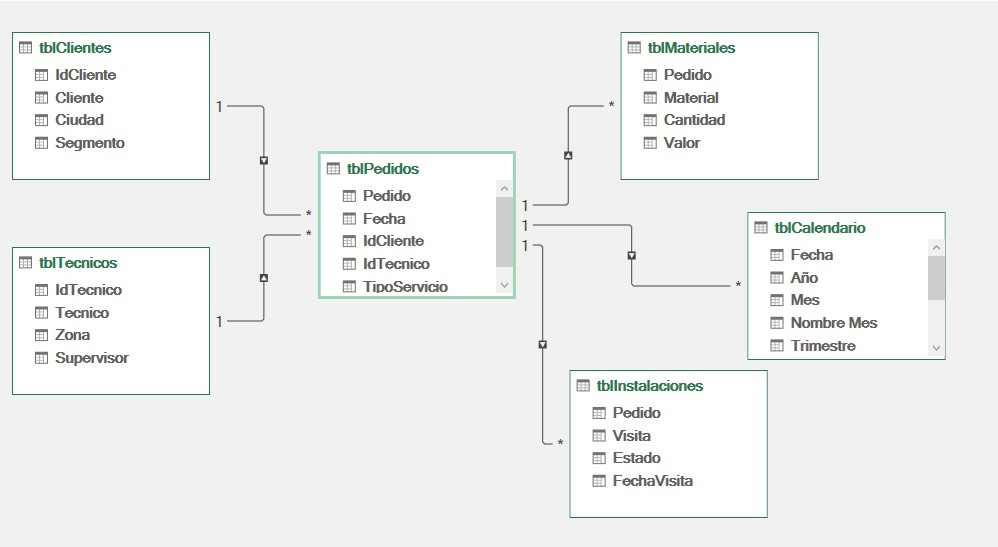

# 📘 Módulo 04 - Relaciones en Power Pivot

> 📚 **Curso:** Excel BI para Analistas de Datos
>
> 📖 **Módulo:** 04 - Relaciones en Power Pivot
>
> 🎯 **Nivel:** Básico - Intermedio
>
> ⏱️ **Duración estimada:** 40 minutos

---

# 🎯 Objetivo

Construir el Modelo de Datos dentro de Power Pivot creando las relaciones entre las tablas del laboratorio y comprendiendo cómo estas relaciones permiten analizar información sin utilizar fórmulas de búsqueda como BUSCARV o BUSCARX.

---

# 📖 Introducción

En el módulo anterior aprendimos a identificar:

- La Tabla de Hechos.
- Las Tablas Dimensión.
- Las Tablas de Detalle.
- Las llaves primarias.
- Las llaves foráneas.
- El modelo Star Schema.

En este módulo construiremos ese diseño dentro de Power Pivot. Pasaremos del modelo conceptual al modelo físico.

---

# 🏢 Caso empresarial

Utilizaremos el archivo **Empresa_Telecom_ExcelBI_v3.xlsx**.

Las tablas del laboratorio son:

- tblClientes
- tblTecnicos
- tblPedidos
- tblMateriales
- tblInstalaciones
- tblCalendario

Todas ya fueron agregadas al Modelo de Datos. El siguiente paso consiste en relacionarlas correctamente.

---

# ¿Qué aprenderás?

- Abrir la Vista de Diagrama.
- Interpretar el Modelo de Datos.
- Crear relaciones 1:N.
- Comprender el significado del lado **1** y del lado **\***.
- Entender cómo viajan los filtros entre tablas.
- Validar el modelo antes de comenzar con DAX.

---

# 🧪 Laboratorio

## Paso 1

Abrir la ventana de **Power Pivot**.

## Paso 2

Cambiar a **Vista de Diagrama**.

En esta vista se observan todas las tablas cargadas al Modelo de Datos.

## Paso 3

Crear las relaciones:

### Clientes → Pedidos

Campo:

- IdCliente

Relación:

```text
Clientes (1)
      │
      │
Pedidos (*)
```

---

### Técnicos → Pedidos

Campo:

- IdTecnico

```text
Tecnicos (1)
      │
      │
Pedidos (*)
```

---

### Pedidos → Materiales

Campo:

- Pedido

```text
Pedidos (1)
      │
      │
Materiales (*)
```

---

### Pedidos → Instalaciones

Campo:

- Pedido

```text
Pedidos (1)
      │
      │
Instalaciones (*)
```

---

### Calendario → Pedidos

Campo:

- Fecha

```text
Calendario (1)
       │
       │
Pedidos (*)
```

---

# 🖼 Modelo obtenido

A continuación se muestra el Modelo de Datos construido en Power Pivot después de crear todas las relaciones del laboratorio.

Este será el modelo base sobre el cual construiremos las medidas DAX en los siguientes módulos.



> **Figura 4.1** Modelo de Datos del laboratorio Empresa_Telecom_ExcelBI_v3.xlsx.

# Interpretando el Modelo

Cada relación representa una regla del negocio.

- Un cliente puede tener muchos pedidos.
- Un técnico puede atender muchos pedidos.
- Un pedido puede utilizar varios materiales.
- Un pedido puede requerir varias visitas.
- Una fecha puede tener muchos pedidos.

---

# ¿Qué significa el número 1?

El lado **1** representa la tabla donde la llave es única.

Ejemplo:

IdCliente solo aparece una vez en la tabla Clientes.

---

# ¿Qué significa el símbolo *?

El lado **\*** representa la tabla donde el valor puede repetirse.

Ejemplo:

Un mismo IdCliente puede aparecer en muchos pedidos.

---

# ¿Cómo viajan los filtros?

Supongamos que en una Tabla Dinámica seleccionamos:

**Ciudad = Medellín**

Power Pivot realiza internamente este recorrido:

```text
Clientes
    │
    ▼
Pedidos
    │
    ▼
Materiales
```

No utiliza BUSCARV ni copia datos entre tablas. Utiliza las relaciones del Modelo de Datos.

---

# Verificando el Modelo

Antes de continuar con DAX verifica:

- Todas las relaciones son 1:N.
- No existen relaciones muchos a muchos.
- No existen registros huérfanos.
- Todas las tablas están conectadas.
- La Vista de Diagrama coincide con el diseño del laboratorio.

---

# ⭐ Buenas prácticas

- Relacionar siempre llave primaria con llave foránea.
- Nombrar correctamente las tablas.
- Mantener una Tabla de Hechos central.
- Evitar relaciones innecesarias.
- Validar el modelo antes de crear medidas.

---

# ⚠️ Errores frecuentes

- Relacionar columnas equivocadas.
- Crear relaciones entre tablas sin lógica de negocio.
- Utilizar columnas duplicadas como lado 1.
- Pensar que agregar tablas al Modelo de Datos crea relaciones automáticamente.

---

# 📝 Lo que aprendí

En este módulo construí el Modelo de Datos dentro de Power Pivot utilizando la Vista de Diagrama. Aprendí a crear relaciones correctamente, interpretar la cardinalidad 1:N y comprender cómo Power Pivot propaga automáticamente los filtros entre tablas. El modelo quedó preparado para comenzar a trabajar con DAX.

---

# 🎯 Ejercicio

Utilizando el archivo **Empresa_Telecom_ExcelBI_v3.xlsx**:

1. Recrea todas las relaciones.
2. Identifica la llave primaria y la llave foránea de cada relación.
3. Explica por qué todas las relaciones son 1:N.
4. Describe el recorrido del filtro desde Clientes hasta Materiales.
5. Explica qué ocurriría si IdCliente estuviera duplicado en la tabla Clientes.

---

# 🚀 Próximo módulo

## 📘 Módulo 05 - Introducción a DAX

En el siguiente módulo comenzaremos a trabajar con el lenguaje DAX, aprenderemos la diferencia entre medidas y columnas calculadas, la sintaxis básica y las primeras funciones para analizar información utilizando el Modelo de Datos construido en este laboratorio.
